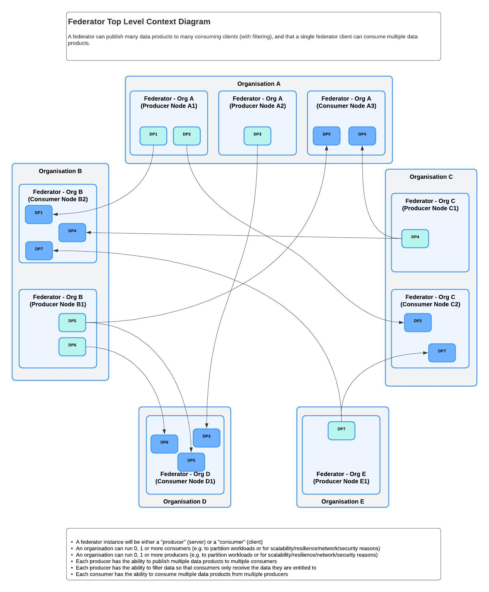
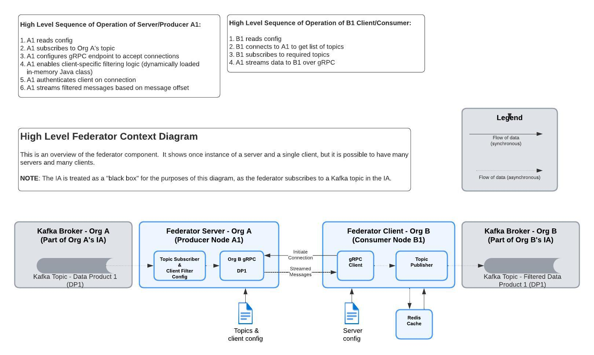

# README

**Repository:** `federator`  
**Description:** `Provides a mechanism to exchanged data between Integration Architecture (IA) nodes`

<!-- SPDX-License-Identifier: Apache-2.0 AND OGL-UK-3.0 -->

--- 

## Overview

This repository contributes to the development of **secure, scalable, and interoperable data-sharing infrastructure**. It supports NDTP’s mission to enable **trusted, federated, and decentralised** data-sharing across organisations.

This repository is one of several open-source components that underpin NDTP’s **Integration Architecture (IA)**—a framework designed to allow organisations to manage and exchange data securely while maintaining control over their own information. The IA is actively deployed and tested across multiple sectors, ensuring its adaptability and alignment with real-world needs.

For a complete overview of the Integration Architecture (IA) project, please see the [Integration Architecture Documentation](https://github.com/National-Digital-Twin/integration-architecture-documentation).

## Prerequisites

* Java 17
* This repo uses a maven wrapper so no installation of maven is required.
* [Docker](https://www.docker.com/)
* [Git](https://git-scm.com/)

## Quick Start

Follow these steps to get started quickly with this repository. For detailed installation, configuration, and deployment, refer to the relevant MD files.

### 1. Download and Build

To download from the github repository run the following commands:

```shell
git clone https://github.com/National-Digital-Twin/federator.git
cd federator  
```

To run a demo with multiple Federator clients and multiple Federator servers run the following commands from the project root directory:

Compile the java source code:  (Replace `./mvnw` with `mvn` to use the maven without the wrapper)

```shell
./mvnw clean install
```

Build the docker containers:

```shell
docker compose --file docker/docker-compose-multiple-clients-multiple-server.yml build
```

### 2. Run Build Version

Run the docker containers:

```shell
docker compose --file docker/docker-compose-multiple-clients-multiple-server.yml up
```

You should then see the service running within docker containers. These contain multiple clients and multiple servers and their supporting services.  
The service will move the data from the topic(s) in the kafka-src to federated topic(s) in kafka-target.

### 3. Installation

Refer to [INSTALLATION.md](INSTALLATION.md) for detailed installation steps, including required dependencies and setup configurations.

### 4. Uninstallation

For steps to remove this repository and its dependencies, see [UNINSTALL.md](UNINSTALL.md).

## Features

The federator allows data exchange between Integration Architecture nodes. The system consists of a server which can be thought of as a producer of data and a client which can be thought of as a consumer of data.  These terms are used interchangeably in the documentation.

The server (producer) solution allows the continual update of a second Integration Architecture node by streaming data over to network to a client (consumer).
The client requests topic information from the server, it then requests data and integrates it into the secondary Integration Architecture node, recording the offset position. The solution polls periodically for new data.

The decision on what Kafka messages are shared (federated) or not shared is made using a filter that currently decides
based on the data held in the Kafka header. This filter takes the client id for the federator and the Kafka message and
makes a decision to share a message or not. The existing default filter will do an exact match on the users credentials
and the `securityLabel` Kafka Header entry (ie `Security-Label:nationality=GBR`). This default filter runs if no value is set for the `filter_classname` attribute for a given client (in the access.json file).
The default filter will use the property values defined in attributes section within a servers access.json file.
If this `filter.classname` value is set and the fully named class can be located on the classpath the federation server
will reflectively build this filter, validate that it can be used and then start the federation service using
this filter.  To configure a custom filter see the [Configuring a Custom Filter](/docs/server-configuration.md) section.

Currently, the federation works with RDF payload only. Hooks have been put in place to extend to other data
formats on topic by topic basis.

A top level overview of the federator service is shown below:



The diagram above shows how the Federator can be used to exchange data between Integration Architecture Nodes that are running within many different organisations.
Each organisation could typically run many servers (producers) and many clients (consumers) to exchange data between their Integration Architecture Nodes.

For example within the above diagram:

- Organisation A (Org A) is show to be running two servers, with one named "Producer Node A1" that is sending messages to the topic named "DP1"
- Organisation B (Org B) is shown to be running a client called "Consumer Node B2" which is reading the messages from the topic named "DP1"

It should be further noted that this diagram shows that many servers (or producers) and many clients (or consumers) can be configured
within each organisation to exchange data between their Integration Architecture Nodes.

### Exchange data between IA nodes

The Federator is designed to allow data exchange between Integration Architecture Nodes.  Kafka brokers are used as both a source of data and a target of data that is to be moved between Integration Architecture nodes. It is run in a distributed manner with multiple servers and clients.

A simplistic view of the federator service is described below:

#### Server (Producer)

1. A server (producer) reads messages from a knowledge topic within the source Kafka broker.
2. The server is configured so that it has a list of clients and the topics that they are allowed to read the messages from.
3. The server also has a configurable filter that is used to decide if a message should be sent to a client.
4. The server filters the messages based on the security label in the message header.
5. The server streams the selected filtered messages to the client(s) using the gRPC protocol over a network.

#### Client (Consumer)

1. A client (consumer) connects and then authenticates with its known server(s) using the gRPC protocol.
2. A client requests the list of topics that it is allowed to read from the server.
3. The client then requests the messages from the server for given topic(s).
4. The client reads the messages and then writes them to a target Kafka broker to a topic name that is prefixed with 'federated'

The underlying communication protocol is [gRPC](https://grpc.io/) which is used to communicate between the server and client at the network level.

### Architecture

#### Federator Server (Producer)

This app starts the data federation server that starts a gRPC service.

This process contains the federator service supplying two RPC endpoints that are called by the client:

- Get Kafka Topics (obtain topics)
- Get kafka Consumer (consume topic)

##### Obtain Topics

1. Is passed a user request (a client-id and key)
2. Authenticate the given credentials
3. Returns the topics that have been assigned to the given user.

##### Consume Topic

1. Is passed a topic request (client-id, key, topic & offset)
2. Validates the given details.
3. Creates a message conductor to process the topic.
4. Consumes and returns messages until stopped.

#### Federator Client (Consumer)

A somewhat simple app it does the following:

1. Obtains topic(s) from the Server
2. Checks with Redis to see what the offset is for given topic
3. Obtain kafka consumer from the Server
4. Process messages from consumer, adding to destination topic and update Redis offset count.
5. Continue (4) until stopped.
   If configured, it will repeat 1-5 upon failures

Please refer to this context diagram as an overview of the federator service and its components:



## Testing Guide

### Introduction
This guide aims to detail how to run tests on the various NDTP repositories. These repositories include Java, Python, JavaScript and more so different testing methods are detailed throughout. This document will cover running **unit tests, integration tests and smoke tests**.

### Unit Tests
Unit testing is a software testing method where individual components or modules of an application are tested in isolation to verify their correctness. These components are often the smallest testable parts of the application, such as functions/methods, or class functions.

To perform unit tests, we use SonarQube. This platform allows us to see coverage (and other useful metrics) inside an easy to use yet powerful web interface hosted locally.

### Starting SonarQube Locally
1. *The following command spins up a docker container for a community edition of SonarQube locally (at time of writing **25.5.0.107428** is the latest version).*
   ```shell
   docker run -p 9000:9000 -e SONAR_ES_BOOTSTRAP_CHECKS_DISABLE=true --name sonarqube sonarqube:25.5.0.107428-community
   ```
  > [!NOTE]
  > The **SONAR_ES_BOOTSTRAP_CHECKS_DISABLE=true** environment flag. This is to bypass Elasticsearch bootstrap checks as they, are not necessary for a local setup and can sometimes cause issues during setup.

2. Go to your web browser and navigate to http://localhost:9000. This will bring up the login portal for SonarQube. When logging in for the first time use admin for both the username and password. It will ask you to set a new password for which you can choose anything of preference. 
  > [!NOTE]  
  > If you get an **Unexpected application error**, refresh the page (it seems to be to do with an overlay not rendering properly).

3. Select **Create a local project** and give it a name (this should ideally be the exact same name as the repository).

4. On the next page, select the **Use the global setting** option and progress to the next page by clicking **Create project**.

5. To create the token required to analyse the repository with SonarQube, scroll towards the bottom of the **Analysis Method** page and click on Locally.

6. You will be prompted to generate a project token or to use an existing token. For the first time setup select **Generate a project token**, The **Expires in** dropdown will default to 30 days, and then click the **Generate** button.

7. On the next page, click **Continue** and then under the **Run analysis on your project** section, select the option that says "Maven".

8. On selecting, the option that best describes your project, follow the steps shown to run a SonarQube analysis (the command provided must be run at the root of the project folder).

> [!WARNING]
> If you get an error while running this command, then check that your Java version matches the expected Java version of the repository. The error message should inform you which version is expected.

## Public Funding Acknowledgment

This repository has been developed with public funding as part of the National Digital Twin Programme (NDTP), a UK Government initiative. NDTP, alongside its partners, has invested in this work to advance open, secure, and reusable digital twin technologies for any organisation, whether from the public or private sector, irrespective of size.

## License

This repository contains both source code and documentation, which are covered by different licenses:
- **Code:** Originally developed by Telicent UK Ltd, now maintained by National Digital Twin Programme. Licensed under the [Apache License 2.0](LICENSE).
- **Documentation:** Licensed under the [Open Government Licence (OGL) v3.0](OGL_LICENSE.md).

By contributing to this repository, you agree that your contributions will be licenced under these terms.

See [LICENSE](LICENSE), [OGL_LICENSE](OGL_LICENSE.md), and [NOTICE](NOTICE.md) for details.

## Security and Responsible Disclosure

We take security seriously. If you believe you have found a security vulnerability in this repository, please follow our responsible disclosure process outlined in [SECURITY](SECURITY.md).

## Contributing

We welcome contributions that align with the Programme’s objectives. Please read our [Contributing](CONTRIBUTING.md) guidelines before submitting pull requests.

## Acknowledgements

This repository has benefited from collaboration with various organisations. For a list of acknowledgments, see [ACKNOWLEDGMENTS](ACKNOWLEDGEMENTS.md).

## Support and Contact

For questions or support, check our Issues or contact the NDTP team on ndtp@businessandtrade.gov.uk.

**Maintained by the National Digital Twin Programme (NDTP).**

© Crown Copyright 2025. This work has been developed by the National Digital Twin Programme and is legally attributed to the Department for Business and Trade (UK) as the governing entity.

