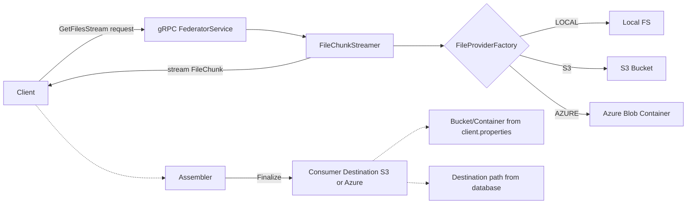
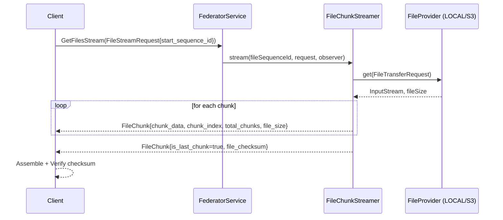
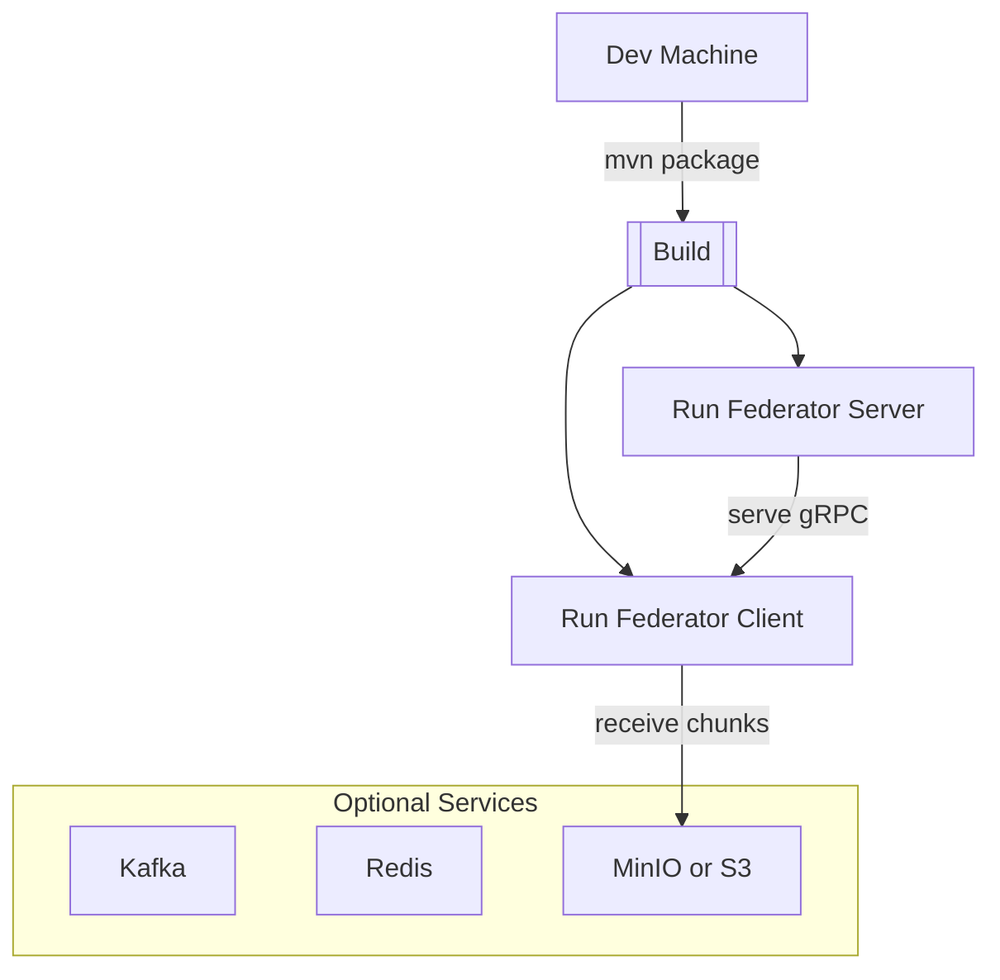
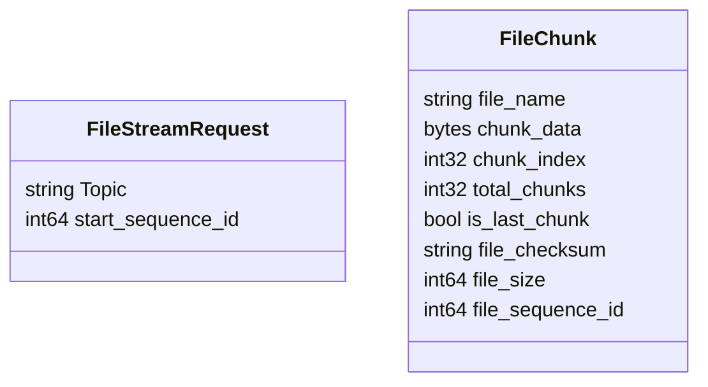
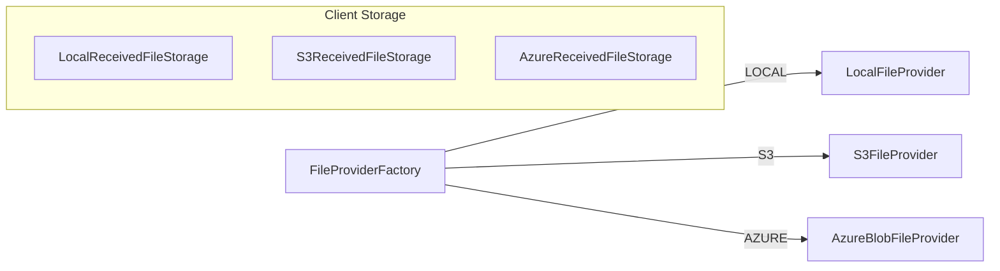
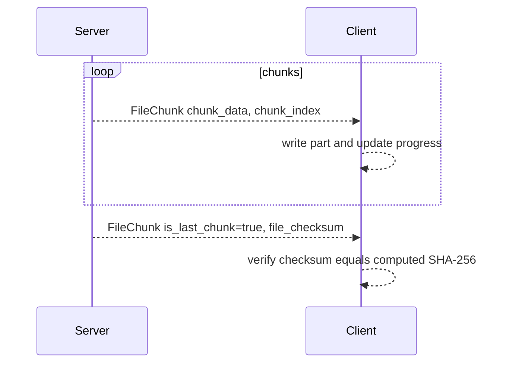
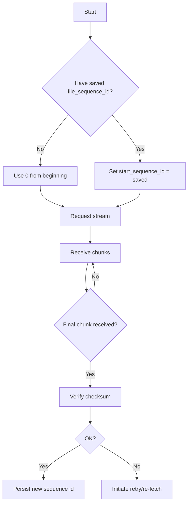
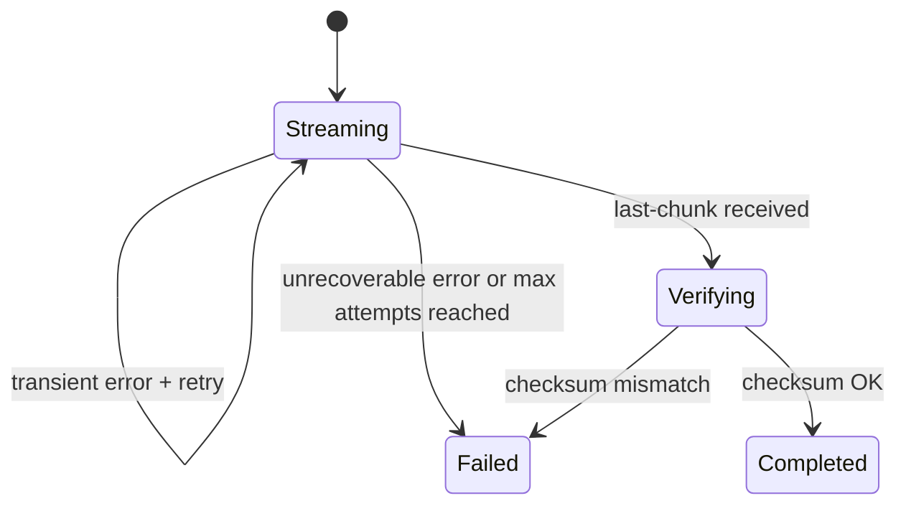
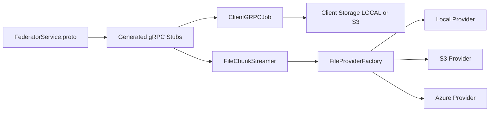

# File Streaming (Server → Client) — Federator

## Overview

This document explains the Federator file streaming capability, which sends files from the server to clients over gRPC as a sequence of chunks. It covers the architecture, stream/chunk protocol, configuration, offsets/resume semantics, storage providers, error handling, and testing guidance.

Key highlights:
- gRPC bidirectional-style server streaming (`GetFilesStream`) delivering `FileChunk` messages.
- Deterministic chunking with a configurable `chunkSize` on the server.
- End-of-file signaled via a final chunk with `is_last_chunk = true` and `file_checksum` (SHA-256).
- Resume support using `start_sequence_id` to continue from a previously received point.
- Producer supports multiple source providers: AWS S3 and Azure Blob Storage, plus Local file system.
- Consumer supports AWS S3 or Azure Blob Storage as the final destination; local disk may be used for temporary assembly.
- Pluggable storage providers (LOCAL, S3, AZURE) for reading and writing files or parts.

## Architecture

At a high level, a client requests a file stream from the Federator server. The server locates and reads the source file (via `FileProvider` implementations) from S3, Azure, or Local and streams chunks to the client. The client assembles and verifies integrity using the final checksum. On the consumer side, the final destination is S3 or Azure, with bucket/container configured in `client.properties` and the object path resolved from database configuration.



### Server-side components
- `FederatorService.proto` defines `GetFilesStream(FileStreamRequest) returns (stream FileChunk)`.
- `FileChunkStreamer` reads the file in `chunkSize` blocks, emits `FileChunk` messages, and sends a final last-chunk with checksum.
- `FileProviderFactory` resolves the concrete `FileProvider` for the configured source type (LOCAL, S3, Azure).

### Client-side components
- A gRPC client (`ClientGRPCJob` orchestrator and related handlers) initiates the stream request, consumes chunks, writes temporary parts, and finalizes the file.
- Client storage is pluggable for temp assembly (LOCAL or S3) and final destination is S3 via implementations such as `S3ReceivedFileStorage`.



## Tech Stack

- gRPC + Protobuf (`FederatorService.proto` → generated stubs in `uk.gov.dbt.ndtp.grpc`)
- Java (server and client components)
- Storage providers: Local filesystem, AWS S3 or S3-compatible such as MinIO, Azure Blob Storage
- Redis and Kafka exist in the broader system; file streaming can be used alongside other data paths

## Getting Started

1. Generate and build the project:
   - `mvn clean package`
2. Start local dependencies (optional demo):
   - See `docker/docker-grpc-resources` for example environments such as MinIO S3 and Azurite Azure. Start the relevant compose file if needed.
3. Configure client properties (see Configuration below), especially storage provider and directories/buckets.
4. Run server and client processes. The client invokes `GetFilesStream` and writes assembled files to the configured storage.



## Configuration

Primary client settings are in `src/configs/client.properties`:
- Storage provider
  - `client.files.storage.provider` = `LOCAL` | `S3` | `AZURE` (default `LOCAL`)
- Local storage
  - `client.files.temp.dir` — directory for received files and temporary parts
  
### Local temp directory (`client.files.temp.dir`)

- Purpose: This directory is used by the client to assemble incoming chunks. During transfer, parts are written to `<base>/.parts/<file>.<seq>.part`. On the final chunk, the `.part` file is moved to `<base>/<file>` and then handed off to the configured storage provider (LOCAL, S3, or AZURE).
- Defaults: If the property is blank or missing, it falls back to `${java.io.tmpdir}/federator-files`.
- Cleanup behavior:
  - Success to remote (S3 or Azure): The assembled local file is best-effort deleted by the remote storage provider after upload.
  - Upload failure: The remote provider also attempts to delete the assembled local file and does not advance offsets.
  - Integrity failure (checksum/size): The assembler deletes the `.part` file and aborts.
  - Interruption/crash: A stale `.part` may remain; you can safely remove `*.part` files that are older than your retention window.
- Production guidance: For large files, mount this path on durable storage with sufficient space. Recommended capacity = peak concurrent files × maximum file size + 20-30% headroom. Ensure the process user has read/write permissions and monitor disk usage.
- S3 settings (also used by server-side components in some deployments)
  - `files.s3.bucket`
  - `aws.s3.region`
  - `aws.s3.access.key.id`
  - `aws.s3.secret.access.key`
  - `aws.s3.endpoint.url` (S3-compatible systems like MinIO)
  - `aws.s3.profile` (SSO/local profiles)

- Azure settings (also used by server-side components in some deployments)
  - `files.azure.container`
  - `azure.storage.connection.string`

### S3 settings — when to set and when to leave blank

The following guidance explains which S3 properties must be set or left blank for common deployment scenarios. The client uses an AWS SDK–style credential resolution (via `S3ClientFactory`) and supports static keys, shared profiles/SSO, or instance/role credentials. Only configure one credentials method at a time.

- files.s3.bucket
  - Set: Always required for the consumer because the final destination is S3 (including S3-compatible like MinIO). The bucket may be a real AWS bucket or a MinIO bucket name.
  - Blank: Only permissible if the consumer is not writing to S3 at all (e.g., local testing where the consumer is not invoked or S3 writes are disabled). In normal consumer runs, do not leave blank.

- aws.s3.region
  - Set: Recommended for AWS. If using static keys or profile, set the AWS region (e.g., `us-east-1`, `eu-west-2`). For MinIO or other S3-compatible endpoints, set to a placeholder like `us-east-1` if the SDK requires a non-empty region.
  - Blank: Acceptable when the region is resolvable from the environment, profile, or instance metadata. Not recommended for local dev as it can be ambiguous.

- aws.s3.access.key.id and aws.s3.secret.access.key
  - Set: For static IAM user credentials or S3-compatible systems like MinIO. Use together as a pair.
  - Blank: When using `aws.s3.profile` (shared config/SSO) or IAM role credentials on EC2/ECS/Lambda (instance/role provider). Also leave blank if relying on environment variables or default provider chain that supplies credentials.

- aws.s3.endpoint.url
  - Set: Only for S3-compatible systems (e.g., MinIO). Example: `http://localhost:9000`.
  - Blank: For real AWS S3 — do not set an endpoint.

- aws.s3.profile
  - Set: When using shared AWS config/credentials profile (including AWS SSO). Example: `default` or `my-sso-profile`.
  - Blank: For static keys, IAM role credentials, or MinIO when providing access/secret directly. Do not set a profile and static keys at the same time.

### Common scenarios and property examples

1) AWS S3 with static access keys
```
files.s3.bucket=my-prod-bucket
aws.s3.region=eu-west-2
aws.s3.access.key.id=AKIA...
aws.s3.secret.access.key=...
aws.s3.endpoint.url=
aws.s3.profile=
```

2) AWS S3 with shared profile (including SSO)
```
files.s3.bucket=my-dev-bucket
aws.s3.region=eu-west-2            # optional if region is in the profile; recommended to set
aws.s3.access.key.id=
aws.s3.secret.access.key=
aws.s3.endpoint.url=
aws.s3.profile=my-sso-profile
```

3) AWS S3 with IAM role on EC2/ECS/Lambda
```
files.s3.bucket=service-bucket
aws.s3.region=eu-west-2            # or leave blank to auto-resolve from instance metadata
aws.s3.access.key.id=
aws.s3.secret.access.key=
aws.s3.endpoint.url=
aws.s3.profile=
```

4) S3‑compatible (MinIO) local development
```
files.s3.bucket=minio-bucket
aws.s3.region=us-east-1            # commonly required placeholder for MinIO
aws.s3.access.key.id=minioadmin
aws.s3.secret.access.key=minioadmin
aws.s3.endpoint.url=http://localhost:9000
aws.s3.profile=
```

### Azure settings — when to set and when to leave blank

The client and server use Azure configuration via `AzureBlobClientFactory` with two options: a connection string or an endpoint URL. If both are provided, the connection string takes precedence.

- files.azure.container
  - Set: Required for the consumer when the final destination is Azure. This is the target container name.
  - Blank: Only permissible if the consumer is not writing to Azure (e.g., using S3 or LOCAL for destination).

- azure.storage.connection.string
  - Set: Recommended for local/dev and Azurite. For real Azure, you can also use the storage account connection string if desired.
  - Blank: Allowed if you configure `azure.storage.endpoint` instead (for managed identity/service principal flows).

- azure.storage.endpoint
  - Set: Use for production when authenticating with DefaultAzureCredential (e.g., Managed Identity or Service Principal). Example: `https://<account-name>.blob.core.windows.net`.
  - Blank: Allowed if you provide `azure.storage.connection.string` instead.

### Common Azure scenarios and property examples

5) Azure Blob Storage (real Azure) — using connection string
```
client.files.storage.provider=AZURE
files.azure.container=my-prod-container
azure.storage.connection.string=DefaultEndpointsProtocol=https;AccountName=...;AccountKey=...;EndpointSuffix=core.windows.net
```

6) Azure Blob Storage (real Azure) — using endpoint with DefaultAzureCredential
```
client.files.storage.provider=AZURE
files.azure.container=my-prod-container
azure.storage.endpoint=https://myaccount.blob.core.windows.net
# No connection string set; authentication resolved by DefaultAzureCredential
```

7) Azurite local development
```
client.files.storage.provider=AZURE
files.azure.container=dev-container
# Default Azurite connection string (Docker compose often exposes 10000/10001)
azure.storage.connection.string=DefaultEndpointsProtocol=http;AccountName=devstoreaccount1;AccountKey=Eby8vdM02xNOcqFeqCdt8x3Pp0G...==;BlobEndpoint=http://127.0.0.1:10000/devstoreaccount1;
```

### Dos and Don'ts
- Do configure only one credential source: static keys OR profile/SSO OR IAM role. Mixing profile and keys can cause ambiguous resolution.
- Do set the correct destination property for the selected provider:
  - For S3: `files.s3.bucket`
  - For Azure: `files.azure.container`
- Don’t set `aws.s3.endpoint.url` for real AWS S3; it is meant for S3‑compatible endpoints like MinIO.
- Don’t leave both keys and profile populated; choose exactly one.

- Streaming (server-side)
  - `file.stream.chunk.size` — chunk size in bytes used by the server when streaming files. If not set, defaults to `1000` bytes. This is read by the server (e.g., in `FileKafkaEventMessageProcessor`) to construct `FileChunkStreamer`.

Producer vs Consumer specifics:
- Producer
  - Supports reading from S3, Azure, or Local depending on the message `sourceType`.
  - For Azure, use Azurite or a real Azure Storage account; provider configuration is resolved by the platform components behind `FileProviderFactory`.
- Consumer
  - Final destination is AWS S3 or Azure Blob Storage. Temporary parts may be written to local disk depending on `client.files.storage.provider`.
  - For S3: bucket name comes from `files.s3.bucket` in `client.properties`.
  - For Azure: container name comes from `files.azure.container` in `client.properties`.
  - The object destination key/prefix (for S3) or blob path (for Azure) comes from database-resident consumer configuration.

Networking and TLS (if enabled):
- `client.p12FilePath`, `client.p12Password`, `client.truststoreFilePath`, `client.truststorePassword`

Other relevant system options include Redis/Kafka groups, retry back-off, and topic prefixing used elsewhere in the broader system.

### Topic Message Schema

Messages pushed to the topic use a JSON payload indicating the source of the file to stream. Example:

```json
{
  "sourceType": "S3",
  "storageContainer": "s3-heg",
  "path": "intellij-java-google-style.xml"
}
```

Fields:
- `sourceType` — the origin provider of the file. Allowed values: `S3`, `AZURE`, `LOCAL` (case-sensitive; all caps).
- `storageContainer` — container name for the file source:
  - For `S3`: the bucket name.
  - For `AZURE`: the blob container name.
  - For `LOCAL`: optional label; actual base directory is resolved by the Local provider configuration.
- `path` — the object key or file path within the container:
  - For `S3`: the object key within the bucket.
  - For `AZURE`: the blob name within the container.
  - For `LOCAL`: the file path relative to the configured base directory.

Notes:
- The message schema selects the producer-side `FileProvider`. The gRPC API remains the same regardless of source.
- Consumer S3 destination is configured separately: bucket from properties, destination key or prefix from database configuration.

## gRPC APIs

Defined in `src/main/proto/FederatorService.proto`:

- `rpc GetFilesStream(FileStreamRequest) returns (stream FileChunk)`
  - Request
    - `Topic` — optional logical topic or collection identifier used by the server to choose files
    - `start_sequence_id` — resume point; `0` means from the beginning
  - Response stream: `FileChunk`
    - `file_name` — logical or source name
    - `chunk_data` — bytes for the data chunk (omitted for the final last-chunk)
    - `chunk_index` — zero-based index for the chunk
    - `total_chunks` — total count (known for data chunks; repeated on final chunk)
    - `is_last_chunk` — `true` when the final, metadata-only chunk is sent
    - `file_checksum` — SHA-256 of the full file (only set on the last chunk)
    - `file_size` — size in bytes of the full file
    - `file_sequence_id` — monotonically increasing identifier for files in a stream



## Storage Providers

Server read path uses `FileProviderFactory` → `FileProvider`:
- LOCAL: reads from a local filesystem path.
- S3: reads from a configured S3 bucket and key.
- Azure: reads from a configured Azure Blob container and blob name.

Client write path uses pluggable storage implementations:
- LOCAL: write parts to `client.files.temp.dir`, then assemble.
- S3: `S3ReceivedFileStorage` uploads to Amazon S3 (or S3-compatible) using bucket from `files.s3.bucket`.
- AZURE: `AzureReceivedFileStorage` uploads to Azure Blob Storage using container from `files.azure.container`.



## Streaming & Chunking

- Chunk size is configured server-side when constructing `FileChunkStreamer` (e.g., via application configuration). It determines throughput and memory usage trade-offs.
- For each chunk:
  - `chunk_index` increments from `0`.
  - `total_chunks` is included with every message to aid progress calculation.
  - `file_size` is included.
  - The server maintains a SHA-256 digest over all chunk bytes.
- After the last data chunk, the server sends a final control message with `is_last_chunk = true`, `file_checksum` set, and the next `chunk_index` value (i.e., `lastChunkIndex`).

### Client assembly lifecycle

- Incoming chunks are written to `<client.files.temp.dir>/.parts` as a single growing `.part` file per stream/file.
- On the last chunk (after checksum/size verification), the `.part` is moved atomically to `<client.files.temp.dir>/<fileName>`.
- The configured client storage provider is invoked:
  - LOCAL: the final file remains under `client.files.temp.dir`.
  - S3: the final file is uploaded and then deleted locally by the S3 provider (best-effort).
  - AZURE: the final file is uploaded and then deleted locally by the Azure provider (best-effort).

Provider note: Chunking and checksumming are provider-agnostic; the same streaming protocol applies whether the source is `S3`, `Azure`, or `Local`.



## Offset Management

Two levels of progress are commonly tracked:
1) File sequence — `file_sequence_id` identifies each file in order.
2) In-file progress — `chunk_index` for partial assembly.

Clients can persist `file_sequence_id` and optionally last fully assembled file. To resume, set `start_sequence_id` in the request.



If the client also tracks partial assembly by `chunk_index`, it can discard duplicates upon resume and continue appending, or restart the file depending on policy.

## Error Handling & Retry

- Server side: Exceptions during streaming produce gRPC `Status.INTERNAL` with cause. The server logs the error and terminates the stream.
- Client side should implement retry with exponential back-off. Suggested options mirror standard properties used elsewhere in the project (e.g., `retries.max_attempts`, `retries.initial_backoff`, `retries.max_backoff`, `retries.forever`).
- Integrity verification: If checksum mismatches, the client must treat the file as incomplete/corrupt and retry from a safe point.

Additional considerations:
- Azure producer source: handle authentication and container resolution errors, including SAS token expiry, missing containers, or network timeouts.
- Consumer destination: if the bucket from `client.properties` is missing or the destination path from the database cannot be resolved, treat as configuration error and fail fast with clear logs for remediation.



## Testing

- Unit tests
  - Validate chunk counting and boundary conditions (exact multiples of `chunkSize`, very small files, empty files).
  - Verify checksum emission matches a standalone SHA-256 of the file.
  - Ensure `is_last_chunk` semantics and `total_chunks` consistency.
- Integration tests
  - End-to-end stream with LOCAL storage.
  - End-to-end stream with MinIO S3 using `aws.s3.endpoint.url` and `files.s3.bucket`.
  - End-to-end stream with Azurite Azure as producer source; consumer still writes to S3.
  - Resume behavior using `start_sequence_id`.
  - Validate topic JSON schema parsing and routing to correct `FileProvider` based on `sourceType`.
- Performance testing
  - Use `docker/docker-grpc-resources/performance-tests` scaffolding to drive large files and different chunk sizes.

## Project Structure

Key locations related to file streaming:
- Protobuf: `src/main/proto/FederatorService.proto`
- Server streaming: `src/main/java/.../server/processor/file/FileChunkStreamer.java`
- Client gRPC job/handlers: `src/main/java/.../client/jobs/handlers/ClientGRPCJob.java`
- Client storage (S3 example): `src/main/java/.../client/storage/impl/S3ReceivedFileStorage.java`
- S3 client factory: `src/main/java/.../common/storage/provider/file/client/S3ClientFactory.java`
- Configuration: `src/configs/client.properties`
- Docker examples: `docker/docker-grpc-resources/*` including `azurite-data` for Azure local dev and `minio-data` for S3-compatible local dev


