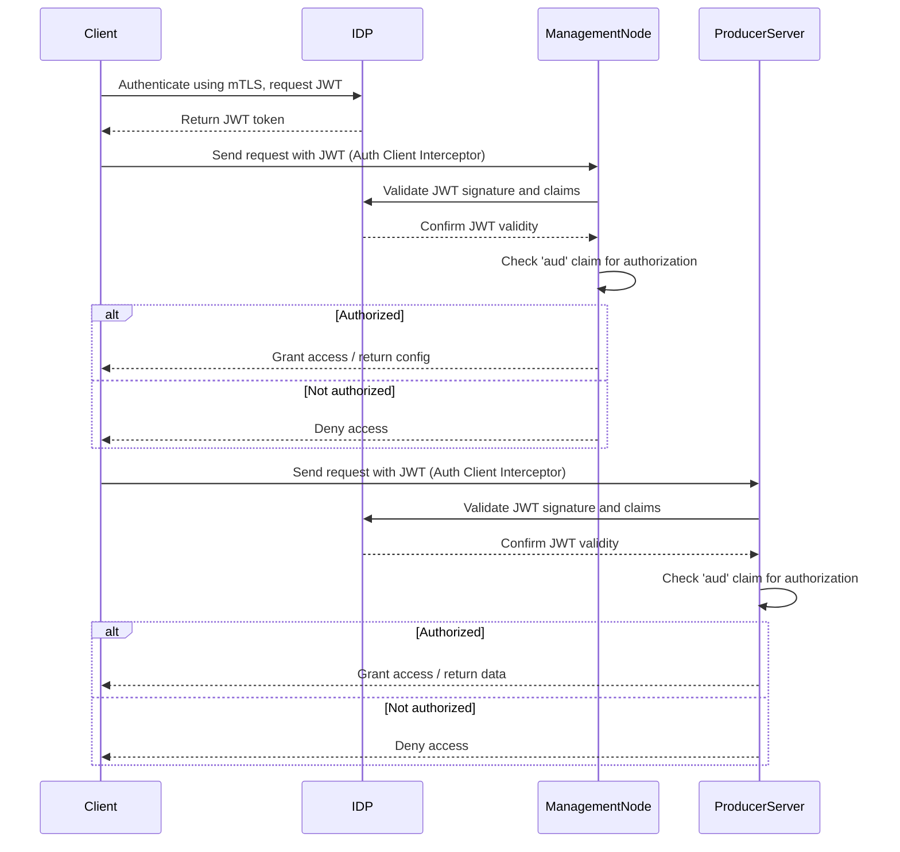

# Authentication Configuration

**Repository:** `federator`  
**Description:** `authentication configuration`

<!-- SPDX-License-Identifier: OGL-UK-3.0 -->

---

# Federator Authentication and Authorization Process

Federator uses mutual TLS (mTLS) and JWT-based authentication and authorization throughout all client-server and client-IDP interactions.

## mTLS Authentication

- **Client to IDP:**
  - When a client starts, it authenticates to the Identity Provider (IDP, e.g., Keycloak) using mTLS.
  - The client presents its certificate to the IDP, which verifies the identity and issues a JWT token.
  - All properties for mTLS (keystore, truststore, passwords) are configured in `common-configuration.properties`.

- **Client to Server (Producer):**
  - The client establishes a secure connection to each producer/server using mTLS.
  - Both client and server verify each other's certificates, ensuring mutual trust and secure communication.

## JWT Token Acquisition and Usage

- After successful mTLS authentication with the IDP, the client receives a JWT token.
- The JWT token is attached to every request from the client to the management node and producer servers using an Auth Client Interceptor.
- The token contains claims that identify the client and its permissions.

## Server-Side Authorization

- When a server receives a request, it validates the JWT token:
  - Verifies the token signature using the IDP's JWKS endpoint.
  - Checks the token's expiration and other standard claims.
  - **Authorization:** The server checks the `aud` (audience) claim in the JWT to ensure the token is intended for this server or service. Only requests with valid audience claims are authorized to access protected resources.
- This process ensures that only authenticated and authorized clients can access server data and operations.

## Authentication & Authorization Sequence Diagram

## Configuration Summary

- All mTLS and JWT properties are set in `common-configuration.properties`:
  - `idp.mtls.enabled`, `idp.keystore.path`, `idp.keystore.password`, `idp.truststore.path`, `idp.truststore.password`, `idp.jwks.url`, `idp.token.url`, `idp.client.id`, etc.
- All authentication and authorization is handled via mTLS and JWT tokens.

## Example Flow

1. **Client Startup:**
   - Loads configuration files and mTLS credentials.
   - Authenticates to IDP using mTLS and requests JWT.
2. **JWT Token Usage:**
   - Attaches JWT to all requests to management node and producer servers.
3. **Server Validation:**
   - Validates JWT signature and claims, including `aud` for authorization.
   - Allows or denies access based on token validity and audience.

---

**Maintained by the National Digital Twin Programme (NDTP).**

© Crown Copyright 2025. This work has been developed by the National Digital Twin Programme and is legally attributed to the Department for Business and Trade (UK) as the governing entity.  
Licensed under the Open Government Licence v3.0.  
For full licensing terms, see [OGL_LICENSE.md](../OGL_LICENSE.md).
