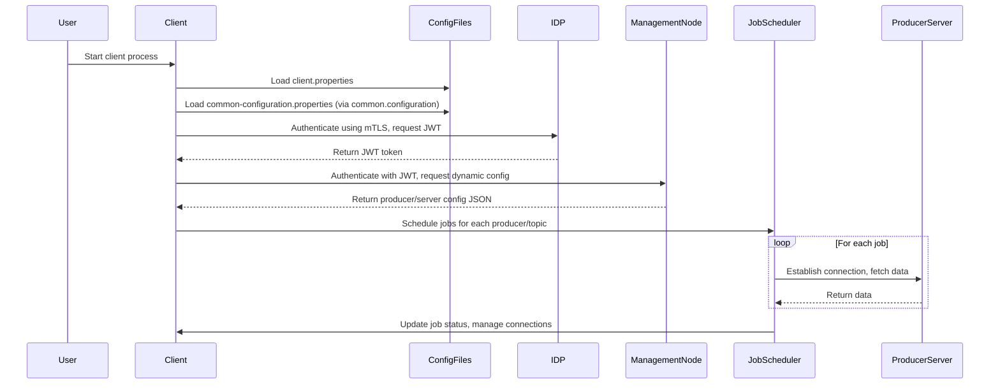
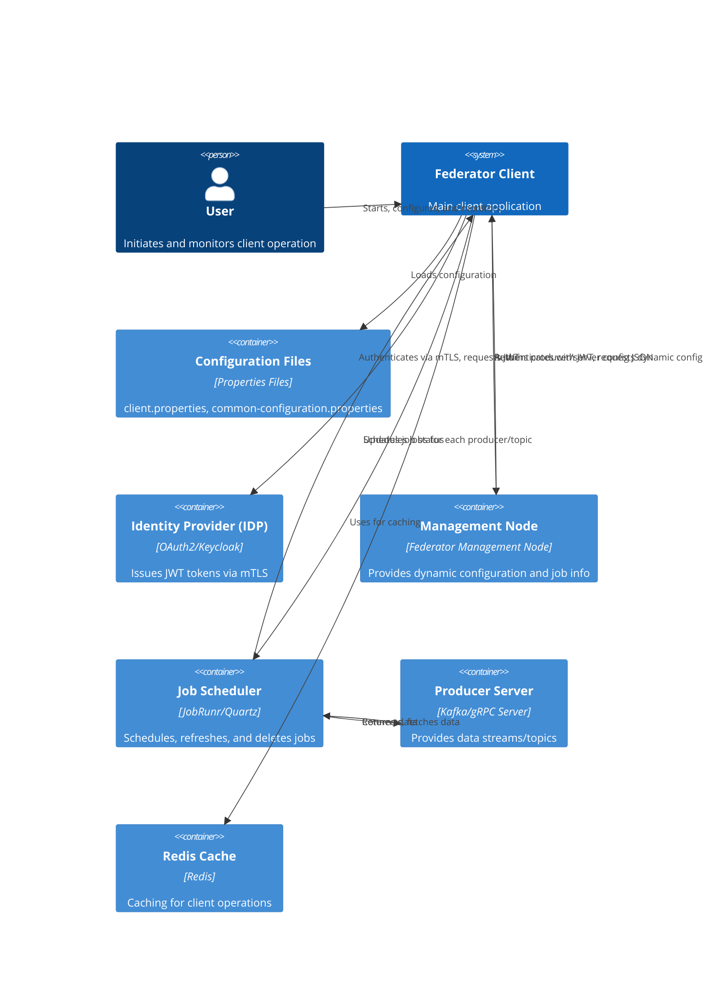

# Client Configuration

**Repository:** `federator`
**Description:** `how to configure and run a federator client`

<!-- SPDX-License-Identifier: OGL-UK-3.0 -->

---

## Overview

This document describes the configuration properties for the Federator client, including connection settings, job parameters, caching, management node, dynamic configuration, and common configuration options shared across Federator components.

## Configuration Files

- **client.properties**: Main client configuration. Location defined by the `FEDERATOR_CLIENT_PROPERTIES` environment variable.
- **common-configuration.properties**: Contains properties shared by both server and client. Location defined by the `common.configuration` property in `client.properties`.

## Client Properties

| Property | Description |
|----------|-------------|
| `kafka.sender.defaultKeySerializerClass` | the default key serializer class |
| `kafka.sender.defaultValueSerializerClass` | the default value serializer class |
| `kafka.bootstrapServers` | the bootstrap server for the target Kafka instance |
| `kafka.topic.prefix` | the prefix for the target Kafka topics |
| `kafka.consumerGroup` | the consumer group for the client |
| `kafka.pollDuration` | duration to poll for messages (ms) - controls how long the client waits for messages before processing |
| `kafka.pollRecords` | number of records to poll per request - controls batching of messages for processing |
| `kafka.additional.*` | a repeatable optional property to set any additional kafka producer properties. These properties names must match with what kafka expects after the prefix has been removed |
| `redis.host` | the host for the redis cache |
| `redis.port` | the port for the redis cache |
| `redis.tls.enabled` | a flag to indicate if TLS is enabled for the redis cache |
| `redis.username` | the username for authenticating connections when redis Access Control List is being used. This can be left empty if either authentication is not required, or if redis only has `requirepass` enabled |
| `redis.password` | the password to be used for authenticating connections to redis. If either authentication is not required this can be left blank |
| `redis.aes.key` | if set, this will be used to encrypt values stored in Redis. The value must be Base64 and decode to 16, 24, or 32 bytes. |
| `consumer.inactivity.timeout` | duration of inactivity (ISO-8601, e.g. PT30S) before the client disconnects from the server due to inactivity |
| `management.node.host` | the hostname of the management node for client coordination and monitoring |
| `management.node.port` | the port of the management node for client coordination and monitoring |

## Running the Client

To run the Federator client, follow these steps:

1. **Prepare Configuration Files:**
   - Ensure `client.properties` contains all required client-specific settings.
   - Ensure `common-configuration.properties` contains shared authentication and security properties.
   - Set the `common.configuration` property in `client.properties` to the path of your `common-configuration.properties` file.

2. **Set Environment Variables:**
   - `FEDERATOR_CLIENT_PROPERTIES`: Path to your `client.properties` file.

   Example (Linux/zsh):
   ```zsh
   export FEDERATOR_CLIENT_PROPERTIES=/path/to/client.properties
   ```

3. **Run the Client:**
   - If using Java directly:
     ```zsh
     java -jar federator-client.jar
     ```
   - If using Docker:
     ```zsh
     docker run --env FEDERATOR_CLIENT_PROPERTIES=/config/client.properties \
                -v /local/config:/config \
                federator-client:latest
     ```

4. **Verify Startup:**
   - Check logs for successful startup and connection to the management node.
   - Ensure jobs are scheduled and connections to producers/servers are established as expected.

**Note:**
- All configuration properties must be set in the respective files. Properties cannot be overridden by environment variables.
- The client will dynamically obtain server connection details from the management node as described above.
- The location of `common-configuration.properties` is set by the `common.configuration` property in `client.properties`.

## Common Configuration Properties

Common properties are defined in `common-configuration.properties` and may include:

| Property | Description |
|----------|-------------|
| `idp.mtls.enabled` | Enable mutual TLS for Identity Provider (IDP) communication (`true`/`false`) |
| `idp.client.secret` | OAuth2 client secret (used when mTLS is disabled) |
| `idp.jwks.url` | JWKS URL of the IDP (used for verifying JWT signatures) |
| `idp.token.url` | Token endpoint URL of the IDP (used to fetch OAuth2 tokens) |
| `idp.token.backoff` | Backoff time in milliseconds before retrying a failed token request (default: 1000 ms) |
| `idp.client.id` | OAuth2 client ID (registered with the IDP) |
| `idp.keystore.path` | Path to client keystore file (PKCS12 or JKS) for mutual TLS |
| `idp.keystore.password` | Password for the client keystore |
| `idp.truststore.path` | Path to truststore containing the IDP's root CA or certificate chain |
| `idp.truststore.password` | Password for the truststore |
| ... | Other shared properties as required |

These settings ensure secure authentication and authorisation between Federator components and the Identity Provider, supporting both mTLS and OAuth2 flows.

## Dynamic Consumer Configuration via Management Node

Federator clients dynamically obtain their server connection details from the management node. The workflow is as follows:

1. **JWT Token Acquisition via mTLS:**
   - The client authenticates with the Identity Provider (IDP, e.g., Keycloak) using mutual TLS (mTLS) and obtains a JWT token.
   - Relevant properties for mTLS and OAuth2 are set in `common-configuration.properties` (see above).

2. **Management Node Authentication:**
   - The client uses the JWT token to authenticate with the management node (configured via `management.node.host` and `management.node.port`).
   - The management node returns a JSON configuration describing available producers/servers and their products/topics.

3. **Dynamic Server Connection:**
   - The client parses the returned JSON and connects to each producer/server listed, using the provided host, port, TLS, and topic details to fetch data.

### Example Management Node Response

```json
{
    "clientId": "FEDERATOR_HEG",
    "producers": [
        {
            "products": [
                {
                    "name": "BrownfieldLandAvailability",
                    "topic": "topic.BrownfieldLandAvailability",
                    "consumers": null
                }
            ],
            "name": "HEG-PRODUCER-1",
            "description": "HEG Producer 1",
            "active": true,
            "host": "localhost",
            "port": 9001,
            "tls": true,
            "idpClientId": "FEDERATOR_HEG"
        },
        {
            "products": [
                {
                    "name": "PendingPlanningApplications",
                    "topic": "topic.PendingPlanningApplications",
                    "consumers": null
                }
            ],
            "name": "BCC-PRODUCER-1",
            "description": "BCC Producer 1",
            "active": true,
            "host": "localhost",
            "port": 9001,
            "tls": true,
            "idpClientId": "FEDERATOR_BCC"
        }
    ]
}
```

Each producer in the response represents a server the client can connect to. The client uses the `host`, `port`, `tls`, and `idpClientId` fields to establish secure connections and fetch data from the specified topics.

**Required Properties:**
- `management.node.host`: Hostname of the management node.
- `management.node.port`: Port of the management node.
- mTLS and OAuth2 properties in `common-configuration.properties` for JWT acquisition.

This approach allows clients to be dynamically configured and managed, supporting secure, scalable, and flexible data integration.

## Job Parameters & Job Configuration

Job parameters control how the client processes messages and interacts with the server. Key properties include:

- `kafka.pollDuration`: How long the client waits for messages before processing (in milliseconds).
- `kafka.pollRecords`: Number of records to poll per request, controlling batching.
- `consumer.inactivity.timeout`: Duration of inactivity before disconnecting from the server (ISO-8601 format, e.g. PT30S).

These parameters can be tuned for performance and resource management.

## Job Scheduler

Federator clients use a Job Scheduler to manage the lifecycle of jobs that control client connections and data fetching. The Job Scheduler supports:

- **Add Jobs:** Schedules new jobs (immediate or recurring) based on dynamic configuration from the management node. Each job may represent a connection to a producer/server and a data fetch operation for a specific topic.
- **Delete Jobs:** Removes scheduled jobs when they are no longer needed, causing the client to disconnect from the associated server or stop fetching data for a topic.
- **Refresh Jobs:** Synchronizes the set of active jobs with the latest configuration from the management node. This ensures the client only maintains connections and fetches data for currently relevant producers/servers and topics.

The Job Scheduler enables real-time adaptation to changes in available producers/servers and their products/topics, supporting dynamic, scalable, and flexible client operation.

## Caching

Federator clients can use Redis for caching. Relevant properties:

- `redis.host`: Redis cache host.
- `redis.port`: Redis cache port.
- `redis.tls.enabled`: Enable TLS for Redis.
- `redis.username`: Username for Redis ACL authentication.
- `redis.password`: Password for Redis authentication.
- `redis.aes.key`: Base64-encoded AES key for encrypting cached values (must decode to 16, 24, or 32 bytes).

## Management Node

Clients may connect to a management node for coordination, monitoring, and control. Relevant properties:

- `management.node.host`: Hostname of the management node.
- `management.node.port`: Port of the management node.

## Auth Client Interceptor

Federator clients use an Auth Client Interceptor to ensure secure, authenticated communication with servers (producers). The interceptor automatically attaches the JWT token—obtained from the Identity Provider (IDP) using mTLS—to every outgoing client request to servers. This mechanism:

- Ensures each request is authenticated and authorized according to the security policies of the management node and producers.
- Integrates seamlessly with dynamic configuration and the job scheduler, so all connections established as a result of job scheduling or configuration updates are properly secured.
- Relies on the mTLS and OAuth2 properties in `common-configuration.properties` for token acquisition and management.

No additional configuration is required for the interceptor beyond the standard authentication properties. This approach guarantees that all client-server interactions are protected and compliant with Federator's security requirements.

## Sequence Diagram



## C4 Diagram

A C4 diagram provides a high-level architectural view of the Federator client and its interactions.



_You can view and edit this diagram using Mermaid live editors or compatible Markdown viewers._

---

**Maintained by the National Digital Twin Programme (NDTP).**

© Crown Copyright 2025. This work has been developed by the National Digital Twin Programme and is legally attributed to the Department for Business and Trade (UK) as the governing entity.  
Licensed under the Open Government Licence v3.0.  
For full licensing terms, see [OGL_LICENSE.md](../OGL_LICENSE.md).
