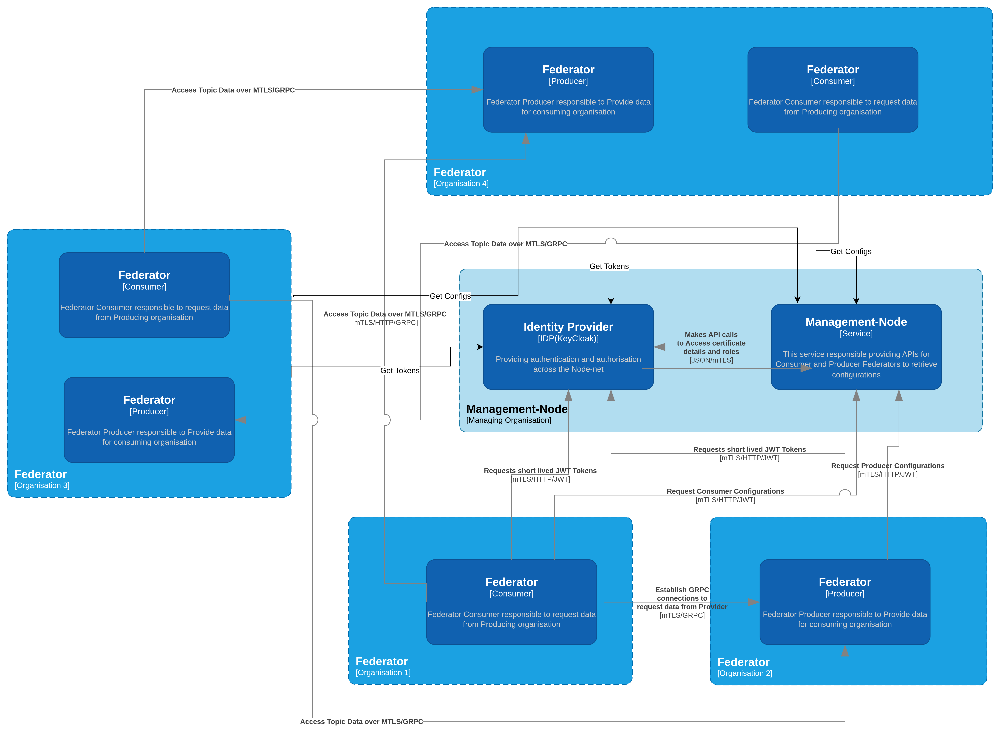
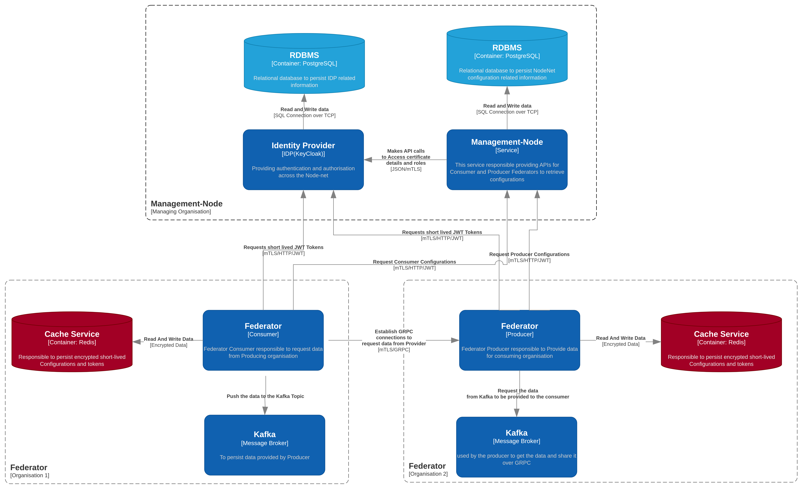

## Overview

This repository contributes to the development of **secure, scalable, and interoperable data-sharing infrastructure**. It supports NDTP’s mission to enable **trusted, federated, and decentralised** data-sharing across organisations.

This repository is one of several open-source components that underpin NDTP’s **Integration Architecture (IA)**—a framework designed to allow organisations to manage and exchange data securely while maintaining control over their own information. The IA is actively deployed and tested across multiple sectors, ensuring its adaptability and alignment with real-world needs.

For a complete overview of the Integration Architecture (IA) project, please see the [Integration Architecture Documentation](https://github.com/National-Digital-Twin/integration-architecture-documentation).

## Prerequisites

* Java 21
* This repo uses a maven wrapper so no installation of maven is required.
* [Docker](https://www.docker.com/)
* [Git](https://git-scm.com/)
* [Management-node](https://github.com/National-Digital-Twin/management-node/)

## Quick Start

Follow these steps to get started quickly with this repository. For detailed installation, configuration, and deployment, refer to the relevant MD files.

### 1. Download and Build

To download from the github repository run the following commands:

```shell
git clone https://github.com/National-Digital-Twin/federator.git
cd federator  
```

To run a demo with multiple Federator clients and multiple Federator servers run the following commands from the project root directory:

Compile the java source code:  (Replace `./mvnw` with `mvn` to use the maven without the wrapper)

```shell
./mvnw clean install
```

Build the docker containers:

```shell
docker compose --file docker/docker-compose-multiple-clients-multiple-server.yml build
```

### 2. Run Build Version

Run the docker containers:

```shell
docker compose --file docker/docker-compose-multiple-clients-multiple-server.yml up
```

You should then see the service running within docker containers. These contain multiple clients and multiple servers and their supporting services.  
The service will move the data from the topic(s) in the kafka-src to federated topic(s) in kafka-target.

### 3. Installation

Refer to [INSTALLATION.md](INSTALLATION.md) for detailed installation steps, including required dependencies and setup configurations.

### 4. Uninstallation

For steps to remove this repository and its dependencies, see [UNINSTALL.md](UNINSTALL.md).

## Features

The federator enables secure data exchange between Integration Architecture nodes, supporting both server (producer) and client (consumer) roles. Key features include:

### Data Federation
- Secure, scalable data sharing using Kafka as both source and target.
- Multiple federator servers and clients per organisation for flexible deployment.
- Filtering of Kafka messages for federation is based on the `securityLabel` in the Kafka message header and the client’s credentials. The default filter performs an exact match between the client’s credentials and the `securityLabel` header (e.g., `Security-Label:nationality=GBR`).
- Custom filtering logic can be configured; see [Configuring a Custom Filter](server-configuration.md) for details.
- Communication between federator servers and clients uses gRPC over mTLS for secure, authenticated data transfer.
- Federation currently supports RDF payloads, with extensibility hooks for other data formats on a per-topic basis.

### File Streaming
- **File Transfer via gRPC**: Stream large files from server to client as chunked messages over the `GetFilesStream` RPC endpoint.
- **Multi-Cloud Storage Support**: Both producer (server) and consumer (client) support multiple storage backends:
  - **Server (Producer)**: Read files from AWS S3, Azure Blob Storage, Google Cloud Storage (GCP), or Local filesystem
  - **Client (Consumer)**: Write files to AWS S3, Azure Blob Storage, Google Cloud Storage (GCP), or Local filesystem
- **Integrity Verification**: SHA-256 checksums ensure file integrity during transfer
- **Resume Support**: Continue interrupted transfers using sequence IDs to avoid re-transferring complete files
- **Graceful Error Handling**: Server sends `StreamWarning` messages for invalid requests without terminating the stream, allowing subsequent files to be processed
- **S3-Compatible Storage**: Support for MinIO and other S3-compatible storage systems
- **Azure Support**: Works with Azure Blob Storage and Azurite emulator for local development
- **GCP Support**: Works with Google Cloud Storage and fake-gcs-server emulator for local development

For detailed file streaming documentation, see [File Streaming README](FILE_STREAMING_README.md).

### Common Infrastructure
- Integration with Management-Node for centralised configuration, topic management, and authorisation.
- Redis is used for offset tracking and short-lived configuration caching.
- JWT-based authentication with Identity Provider (e.g., Keycloak) for consumer verification and authorisation.

An overview of the Federator service architecture is shown below:


The diagram above shows how the Federator can be used to exchange data between Integration Architecture Nodes that are running within many different organisations.
Each organisation could typically run many servers (producers) and many clients (consumers) to exchange data between their Integration Architecture Nodes.

For example within the above diagram:

- Organisation 2 (Org 2) is shown to be running two servers, with one named "Producer Node A1" that is sending messages to the topic named "DP1"
- Organisation 1 (Org 1) is shown to be running a client called "Consumer Node B2" which is reading the messages from the topic named "DP1"

It should be further noted that this diagram shows that many servers (or producers) and many clients (or consumers) can be configured
within each organisation to exchange data between their Integration Architecture Nodes.

Additional note on connectivity and security:
- Multiple Federator Producers and Consumers can exchange data across organisations using gRPC over mTLS.
- As long as they are configured to talk to the same Management-Node, they will obtain compatible configuration (topics, roles, filters, endpoints) required for their data exchange.
- The Management-Node, together with the Identity Provider, issues the certificates/credentials and tokens that enable mutual TLS and authorisation.
- This means any number of Producers and Consumers can safely share data so long as their exchange requirements are defined in, and served by, the Management-Node.

### Exchange data between IA nodes

The Federator is designed to allow data exchange between Integration Architecture Nodes. It supports two primary modes of operation:

1. **RDF Message Streaming**: Kafka-to-Kafka message federation with filtering based on security labels
2. **File Streaming**: Large file transfer with multi-cloud storage support and integrity verification

Both modes use gRPC over mTLS for secure communication and are run in a distributed manner with multiple servers and clients.

#### Server (Producer) - Simplified View

**For RDF Messages:**
1. Reads messages from knowledge topics within the source Kafka broker
2. Authenticates clients using JWT tokens and verifies authorization
3. Filters messages based on security labels in message headers using configurable filters
4. Streams filtered messages to authorized clients via gRPC

**For Files:**
1. Reads files from configured storage (S3, Azure, GCP, or Local filesystem)
2. Authenticates clients using JWT tokens and verifies authorization
3. Chunks files into manageable pieces with a configurable chunk size
4. Streams file chunks to authorized clients via gRPC with SHA-256 checksums for integrity verification

#### Client (Consumer) - Simplified View

**For RDF Messages:**
1. Connects and authenticates with known server(s) using JWT tokens via gRPC
2. Requests message streams for authorized topics
3. Writes received messages to target Kafka broker with a configured topic prefix (e.g., 'federated')
4. Tracks offsets in Redis for resume capability

**For Files:**
1. Connects and authenticates with known server(s) using JWT tokens via gRPC
2. Requests file streams, optionally resuming from a previous sequence ID
3. Assembles received chunks and verifies integrity using SHA-256 checksums
4. Uploads complete files to configured storage destination (S3, Azure, GCP, or Local)
5. Tracks file sequence offsets in Redis for resume capability

The underlying communication protocol is [gRPC](https://grpc.io/) over mTLS, providing secure, authenticated data transfer between servers and clients.

### Architecture

#### Federator Server (Producer)

This app starts the data federation server that starts a gRPC service.

This process contains the federator service supplying RPC endpoints that are called by the client:

- **GetKafkaConsumer** - Stream RDF messages from Kafka topics to clients
- **GetFilesStream** - Stream files as chunks to clients with integrity verification

Both endpoints authenticate clients using JWT tokens and verify authorization against the Management-Node configuration before streaming data.

#### Federator Client (Consumer)

The client connects to one or more servers and performs the following:

**For RDF Message Streaming (GetKafkaConsumer):**
1. Authenticates with the server using JWT tokens
2. Checks Redis for the current offset for each topic
3. Requests message stream from the server
4. Processes messages and writes them to the destination Kafka topic (with configured prefix, e.g., 'federated')
5. Updates Redis offset tracking as messages are processed
6. Continues streaming until stopped; retries on failures if configured

**For File Streaming (GetFilesStream):**
1. Authenticates with the server using JWT tokens
2. Checks Redis for the last processed file sequence ID
3. Requests file stream from the server, optionally resuming from a previous sequence
4. Receives file chunks, assembles them locally, and verifies integrity using SHA-256 checksums
5. Uploads complete files to the configured storage destination (S3, Azure, GCP, or Local)
6. Updates Redis offset tracking as files are successfully processed
7. Handles StreamWarning messages by logging and advancing offsets to skip unrecoverable errors

Please refer to this context diagram as an overview of the federator service and its components:



This diagram illustrates the main components involved in a typical deployment:
- Federator Producer and Federator Consumer communicating over gRPC (mTLS).
- Kafka clusters used by producers and consumers.
- Redis cache used for short‑lived configuration and offsets/tokens.
- Management-Node service that provides configuration to Federators.
- Identity Provider (e.g., Keycloak) used for authentication and authorisation.
- Postgres databases used by the Management-Node and Identity Provider.

See the Architecture section below for more detail on Producer and Consumer responsibilities.

## Testing Guide

### Running Unit Tests

Navigate to the root of the project and run `mvn test` to run the tests for the repository.

## Public Funding Acknowledgment

This repository has been developed with public funding as part of the National Digital Twin Programme (NDTP), a UK Government initiative. NDTP, alongside its partners, has invested in this work to advance open, secure, and reusable digital twin technologies for any organisation, whether from the public or private sector, irrespective of size.

## License

This repository contains both source code and documentation, which are covered by different licenses:
- **Code:** Originally developed by Telicent UK Ltd, now maintained by National Digital Twin Programme. Licensed under the [Apache License 2.0](LICENSE).
- **Documentation:** Licensed under the [Open Government Licence (OGL) v3.0](OGL_LICENSE.md).

By contributing to this repository, you agree that your contributions will be licenced under these terms.

See [LICENSE](LICENSE), [OGL_LICENSE](OGL_LICENSE.md), and [NOTICE](NOTICE.md) for details.

## Security and Responsible Disclosure

We take security seriously. If you believe you have found a security vulnerability in this repository, please follow our responsible disclosure process outlined in [SECURITY](SECURITY.md).

## Contributing

We welcome contributions that align with the Programme’s objectives. Please read our [Contributing](CONTRIBUTING.md) guidelines before submitting pull requests.

## Acknowledgements

This repository has benefited from collaboration with various organisations. For a list of acknowledgments, see [ACKNOWLEDGMENTS](ACKNOWLEDGEMENTS.md).

## Support and Contact

For questions or support, check our Issues or contact the NDTP team on ndtp@businessandtrade.gov.uk.

**Maintained by the National Digital Twin Programme (NDTP).**

© Crown Copyright 2025. This work has been developed by the National Digital Twin Programme and is legally attributed to the Department for Business and Trade (UK) as the governing entity.
