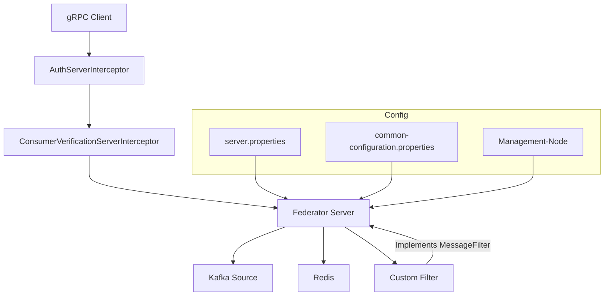

# Server Configuration

**Repository:** `federator`  
**Description:** `server configuration`

<!-- SPDX-License-Identifier: OGL-UK-3.0 -->

--- 

## Overview

This document describes the configuration properties for the Federator server, including connection settings, filtering, and common configuration options shared across Federator components.

## Configuration Files

- **server.properties**: Main server configuration. Location defined by the `FEDERATOR_SERVER_PROPERTIES` environment variable.
- **common-configuration.properties**: Contains properties shared by both server and client. Location defined by the `FEDERATOR_COMMON_PROPERTIES` environment variable.

## Server Properties

| Property                          | Description                                                                                       |
|-----------------------------------|---------------------------------------------------------------------------------------------------|
| `kafka.bootstrapServers`          | Bootstrap servers for the source Kafka instance                                                    |
| `kafka.defaultKeyDeserializerClass`   | Default key deserializer class                                                                |
| `kafka.defaultValueDeserializerClass` | Default value deserializer class                                                              |
| `kafka.consumerGroup`             | Consumer group for the server                                                                     |
| `kafka.pollDuration`              | Duration to poll for messages (ms)                                                                |
| `kafka.pollRecords`               | Number of records to poll per request                                                             |
| `kafka.additional.*`              | Optional: Additional Kafka consumer properties (prefix removed before passing to Kafka)            |
| `shared.headers`                  | Definition of Kafka message headers                                                               |
| `filter.shareAll`                 | If true, all messages are shared (no filtering)                                                   |
| `server.port`                     | Port the server listens on                                                                        |
| `server.tlsEnabled`               | If true, enables TLS for gRPC communication                                                       |
| `server.keepAliveTime`            | Keep-alive time for the server (ms)                                                               |

## Common Configuration Properties

Common properties are defined in `common-configuration.properties` and may include:

| Property                   | Description                                                                                   |
|----------------------------|-----------------------------------------------------------------------------------------------|
| `idp.mtls.enabled`         | Enable mutual TLS for Identity Provider (IDP) communication (`true`/`false`)                  |
| `idp.client.secret`        | OAuth2 client secret (used when mTLS is disabled)                                             |
| `idp.jwks.url`             | JWKS URL of the IDP (used for verifying JWT signatures)                                       |
| `idp.token.url`            | Token endpoint URL of the IDP (used to fetch OAuth2 tokens)                                   |
| `idp.token.backoff`        | Backoff time in milliseconds before retrying a failed token request (default: 1000 ms)        |
| `idp.client.id`            | OAuth2 client ID (registered with the IDP)                                                    |
| `idp.keystore.path`        | Path to client keystore file (PKCS12 or JKS) for mutual TLS                                  |
| `idp.keystore.password`    | Password for the client keystore                                                              |
| `idp.truststore.path`      | Path to truststore containing the IDP's root CA or certificate chain                          |
| `idp.truststore.password`  | Password for the truststore                                                                   |
| ...                        | Other shared properties as required                                                           |

All properties can be set directly or via environment variables (see `${...}` syntax in the file). These settings ensure secure authentication and authorisation between Federator components and the Identity Provider, supporting both mTLS and OAuth2 flows.

## Custom Filter Configuration

Federator supports custom filtering logic for Kafka messages. The producer (server) receives consumer attribute configuration from the Management-Node as JSON, for example:

```json
{
  "clientId": "FEDERATOR_HEG",
  "producers": [
    {
      "products": [
        {
          "name": "BrownfieldLandAvailability",
          "topic": "topic.BrownfieldLandAvailability",
          "consumers": [
            {
              "name": "ENV-CONSUMER-1",
              "idpClientId": "FEDERATOR_ENV",
              "attributes": [
                { "name": "nationality", "value": "GBR", "type": "string" },
                { "name": "clearance", "value": "0", "type": "string" },
                { "name": "organisation_type", "value": "NON-GOV3", "type": "string" }
              ]
            }
          ]
        }
      ],
      "name": "HEG-PRODUCER-1",
      "idpClientId": "FEDERATOR_HEG"
    }
  ]
}
```

### Filtering Logic
- **No attributes set:** All data is passed to the client.
- **One attribute set:** Only messages with a matching attribute and value are passed.
- **Multiple attributes set:** Messages must match all attributes (AND logic).

The filter checks Kafka message headers for the required attributes and values. For example, if a consumer requires `nationality=GBR` and `clearance=0`, only messages with both headers will be delivered.

### Example Filter Implementation
```java
public class AttributeBasedMessageFilter implements MessageFilter {
    private final Map<String, String> requiredAttributes;
    public AttributeBasedMessageFilter(Map<String, String> requiredAttributes) {
        this.requiredAttributes = requiredAttributes;
    }
    @Override
    public boolean filterOut(KafkaEvent<?, ?> message) {
        if (requiredAttributes == null || requiredAttributes.isEmpty()) {
            return false; // No attributes: pass all messages
        }
        for (Map.Entry<String, String> entry : requiredAttributes.entrySet()) {
            String headerValue = message.getHeader(entry.getKey());
            if (!entry.getValue().equals(headerValue)) {
                return true; // Filter out if any attribute does not match
            }
        }
        return false; // Pass if all attributes match
    }
}
```

For details on authentication and key generation, see [Authentication Configuration](authentication.md).

## Interceptors

Federator uses gRPC server interceptors to enforce authentication and authorization for all incoming requests:

### AuthServerInterceptor
- Validates the presence and format of the Authorization header (expects a Bearer token).
- Verifies the JWT token using the Identity Provider (IDP) public keys or mTLS.
- Rejects requests with missing, invalid, or expired tokens.
- Configuration properties used: `idp.jwks.url`, `idp.token.url`, `idp.mtls.enabled`, etc.

### ConsumerVerificationServerInterceptor
- Extracts the consumer ID from the JWT token.
- Validates the token audience against the configured client ID (`idp.client.id`).
- Authorizes the consumer by checking the producer configuration (from Management-Node) to ensure the consumer is permitted for the requested product/topic.
- Attaches the verified consumer ID to the gRPC context for downstream use.
- Rejects requests from unauthorized consumers or with invalid audience.

These interceptors are essential for secure, multi-tenant operation, ensuring only authenticated and authorized clients can access federated data. For implementation details, see:
- [`AuthServerInterceptor.java`](../src/main/java/uk/gov/dbt/ndtp/federator/grpc/interceptor/AuthServerInterceptor.java)
- [`ConsumerVerificationServerInterceptor.java`](../src/main/java/uk/gov/dbt/ndtp/federator/grpc/interceptor/ConsumerVerificationServerInterceptor.java)

## Configuration Flow Diagram




**Maintained by the National Digital Twin Programme (NDTP).**

© Crown Copyright 2025. This work has been developed by the National Digital Twin Programme and is legally attributed to the Department for Business and Trade (UK) as the governing entity.  
Licensed under the Open Government Licence v3.0.  
For full licensing terms, see [OGL_LICENSE.md](../OGL_LICENSE.md).
